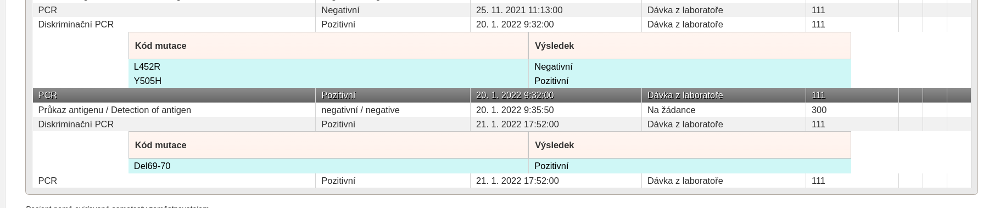
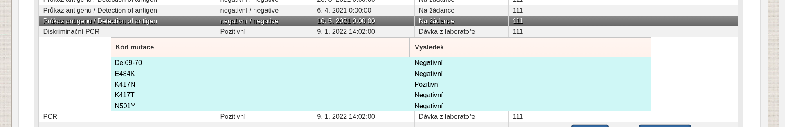
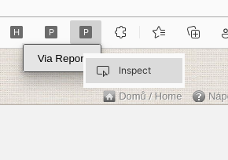
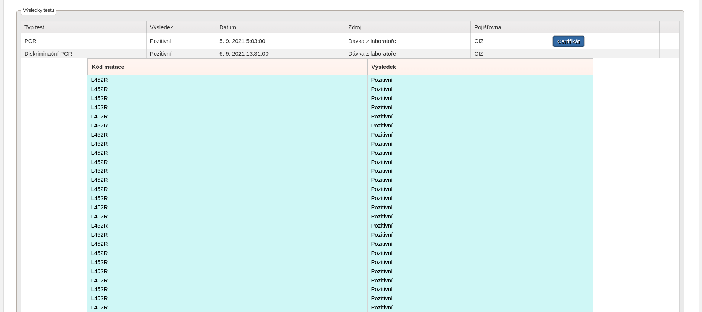

# PRO OC Mutation finder





Rozšíření do prohlížeče obsahující automatický skript, který prochází přiložené Covid-19 žádanky a k nim asociované profily pacientů s cílem vypsat všechny pacientovi zjištěné mutace diskriminačními RT-PCR testy.

## Zásady ochrany osobních údajů

Osobní informace pacientů podmíněné přihlášením do modulu [Pacienti COVID-19](https://ereg.ksrzis.cz/Registr/CUDZadanky/VyhledaniPacienta) jsou použity pouze pro zavolání již stávajících funkcí modulu. **Data nejsou jakkoliv zpracovávána ani přeposílána mimo tyto systémy.**

## Účel

Vypsat všechny pozitivní mutace zjištěné diskriminačními PCR testy.

## Použití

1. Přesunout soubor se žádankami do složky **Assets/Žádanky.xlsx** ve formátu:
- **1. řádek** obsahující sloupce v tomto pořadí: Datum, Číslo žádanky, Jméno, Příjmení, Číslo pojištěnce, Číslo pacienta, Stav žádanky, Pojišťovna (řádek je nepovinný, může zůstat prázdný, data se ale vždy začínají načítat až od 2. řádku)
- **2. až n. řádek** konkrétních dat (nepovinné sloupce jsou Datum, Stav žádanky a Pojišťovna) 
- žádanky za předchozí den je pro přihlášené zdravotnické zařízení možné v tomto formátu vyexportovat na stránce [Moje žádanky](https://ereg.ksrzis.cz/Registr/CUDZadanky/MojeZadanky)


2. Přihlásit se do webové aplikace [Žádanky Covid-19](https://eregpublicsecure.ksrzis.cz/Registr/CUD/Overeni/Prihlaseni) a modulu [Pacienti Covid-19](https://eregotp.ksrzis.cz/), kde je potřeba zakliknout roli Vakcinace
3. Rozšíření nahrát do prohlížeče, kliknout na ikonu rozšíření (v případě potřeby zobrazení logování kliknout prozkoumat popup okno a otevřít záložku console),  kliknout na tlačítko pod ikonou rozšíření



4. Zobrazené logy v consoli lze zpřehlednit např. takto `cat greg-before.log | uniq | grep '^popup.js:*' | cut -b 20- | sort -n -k5 -k4 -k3 > grep-after.log`

## Logování

- Každý záznam uvádí číslo žádanky ke které se vztahuje

```
...
popup.js:72 Mutace 15. 08. 2021 20:06:00 3032525969 L452R
popup.js:72 Mutace 15. 08. 2021 20:06:00 3032525969 P681R
popup.js:72 Mutace 02. 01. 2022 16:26:00 2990218714 Del69-70
popup.js:72 Mutace 02. 01. 2022 16:26:00 2990218714 K417N
popup.js:72 Mutace 05. 01. 2022 12:37:00 3030669682 Del69-70
popup.js:72 Mutace 05. 01. 2022 12:37:00 3030669682 E484K
popup.js:72 Mutace 06. 01. 2022 14:53:00 3737366921 Del69-70
popup.js:72 Mutace 06. 01. 2022 14:53:00 3737366921 E484K
popup.js:72 Mutace 06. 01. 2022 14:54:00 6003207841 Del69-70
popup.js:72 Mutace 06. 01. 2022 14:54:00 6003207841 E484K
popup.js:72 Mutace 11. 01. 2022 14:59:00 7337063288 Del69-70
...
```

## Problémy

- Stává se relativně často, že zadané mutace u konkrétního konfirmačního RT-PCR testu jsou duplikované




